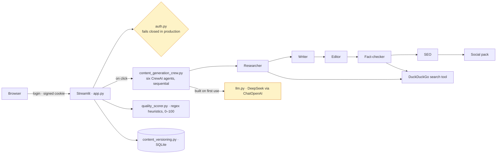

# Editorial Suite

A Streamlit application that runs six CrewAI agents — researcher, writer,
editor, fact-checker, SEO pass, social-media pack — over one DeepSeek model to
turn a topic into a draft article, scores the draft with a regex-based
heuristic, and keeps each version in SQLite. Behind a login gate that fails
closed.

[](https://github.com/daniellopez882/The-Autonomous-Editorial-Suite/actions/workflows/ci-cd.yml)

> **On the claims.** The previous README ("QuantumContent") described an
> "industrial-grade Autonomous Editorial Suite" delivering "publication-ready
> assets, SEO dominance, and viral distribution packs in seconds", with
> "Post-GPT reasoning" and "CSS3 hardware acceleration". It is six prompts, a
> web-search tool, a scoring function and a table. Nothing here measures
> quality, reach or time saved; where a number appears below, the command that
> produced it appears beside it.

> **Origin.** This repository is derived from
> [`Ismail-2001/Content-Generation-Pipeline-Agent`](https://github.com/Ismail-2001/Content-Generation-Pipeline-Agent).
> The `LICENSE` file names Ismail as copyright holder, and `CHANGELOG.md`,
> `CONTRIBUTING.md`, `DEPLOYMENT.md`, `docs/` and the issue templates still link
> the upstream project. The work recorded below hardens that code; it is not
> presented as original.

---

## What runs



The agents are prompts with roles; the researcher and fact-checker can call a
DuckDuckGo search. The pipeline is sequential and synchronous: a generation
blocks the Streamlit session until the last task returns. The quality score is
a cheap first-pass filter over the text ([ADR 0002](docs/adr/0002-the-quality-score-is-a-heuristic-gate.md)),
not a judgement of quality; the fact-checker is a prompt, not a control.

## What was fixed

Reproduced on the original code before each fix; every row has a test or a CI
probe.

### In the pull request

| Defect | Consequence |
|---|---|
| The session cookie was signed with `"some_random_secret_key"`, committed to the repository | Anyone who had read the repository could forge a logged-in session and skip the login form |
| Default credentials `admin` / `admin`; `ENABLE_AUTH=false` disabled the gate with no guard | An open application whenever the operator forgot a variable |
| `setup_auth()` read a `config.yaml` that `create_default_config()` (body: `pass`) never wrote | `FileNotFoundError`; a second auth implementation that disagreed with the first about where credentials come from |
| `stauth.Hasher([password]).generate()` with an unpinned `streamlit-authenticator` | `TypeError` on 0.4.x, which the unconstrained install resolved to |
| The quality scorer applied the SEO weight with no keyword, counted `## ` as H1s, capped structure below its stated maximum, and recommended nothing for three of five dimensions | Identical content lost 7.5 points for not being given a keyword; the "one H1" bonus was unreachable; "Content looks great!" over zero scores |
| CI carried `continue-on-error: true` on the test step and had no tests to run; `black` and `ruff format` both configured and disagreeing | A pipeline that could not fail; red on `main` over formatting |
| Thirteen bare package names with no constraints | Two installs a week apart resolved different majors |

### In the follow-up (2026-09-06)

| Defect | Consequence |
|---|---|
| `content_generation_crew.py` built `ChatOpenAI(openai_api_key=None, ...)` at import when `DEEPSEEK_API_KEY` was unset, and `app.py` imported the crew at the top of the script | `OpenAIError: Missing credentials` — a deployment without the key rendered the import traceback instead of the login form. The client is built on first use and a missing key is reported in the page ([ADR 0003](docs/adr/0003-the-model-client-is-built-on-first-use.md)) |
| Nothing checked the configuration before Streamlit started | With the gate misconfigured, the process was up and the health check said "ok" while every page showed an error. `preflight.py` runs in the entrypoint and exits with the reason; the image defaults to `ENVIRONMENT=production` ([ADR 0001](docs/adr/0001-the-login-gate-fails-closed.md)) |
| The image ran as root, single-stage, with `build-essential` in the runtime layer, `curl` for the health check and no `.dockerignore`; CI built it and never ran it | Two stages, uid 10001, Python health probe, `.dockerignore`; CI boots the image, checks health and `GET /`, asserts no traceback in the log, a non-root uid, and that a production start without a password is refused |
| `docker-compose.yml` passed only `DEEPSEEK_API_KEY` | It now requires the signing key and password the gate needs |
| The UI showed "Complexity Index: High" as a constant metric | Removed; the two remaining metrics are counts from the run |
| `bandit` was `continue-on-error: true`; no dependency audit | Both fail the build now |
| `build_authenticator` passed a fifth positional argument, `pre_authorized`, that streamlit-authenticator 0.4.x rejects with `DeprecationError`; the pinned range resolves to 0.4.x on a fresh install | Found by opening the booted container in a browser: the login page was that traceback. The suite had tested the key and password rules but never constructed the authenticator. Argument removed; a test now constructs it in both environments |
| `.env.example` shipped `APP_PASSWORD=admin` and a placeholder signing key as the values to copy, plus a `SERPER_API_KEY` nothing reads | It now lists what the code reads, with the production rules beside each variable |

## Quick start

```bash
git clone https://github.com/daniellopez882/The-Autonomous-Editorial-Suite.git
cd The-Autonomous-Editorial-Suite
python -m venv .venv && .venv/bin/pip install -r requirements-dev.txt
cp .env.example .env            # DEEPSEEK_API_KEY for generation; APP_* for the gate
.venv/bin/pytest -q
.venv/bin/streamlit run app.py
```

In development the gate accepts `admin` / `admin` and signs its cookie with a
random per-process key. Without `DEEPSEEK_API_KEY` the app starts, you can log
in, and the generate button answers with a sentence naming the variable.

Container:

```bash
APP_SECRET_KEY=$(python -c "import secrets; print(secrets.token_urlsafe(32))") \
APP_PASSWORD=choose-one DEEPSEEK_API_KEY=... docker compose up --build
```

The image runs as uid 10001 with `ENVIRONMENT=production`; the entrypoint
refuses to start without a real signing key and password.

## Configuration

See [`.env.example`](.env.example).

| Variable | Default | Notes |
|---|---|---|
| `DEEPSEEK_API_KEY` | unset | Needed to generate; the app runs without it and says so |
| `DEEPSEEK_MODEL`, `DEEPSEEK_BASE_URL` | `deepseek-chat`, `https://api.deepseek.com/v1` | Any OpenAI-compatible endpoint |
| `APP_SECRET_KEY` | random per process in development | **Required** in production; signs the session cookie |
| `APP_PASSWORD` | `admin` in development | **Required** in production; `admin` / `password` / `changeme` / empty refused |
| `APP_USERNAME` | `admin` | One user |
| `ENABLE_AUTH` | `true` | `false` is refused in production |
| `ENVIRONMENT` | `development` | The image sets `production` |

## Testing

```bash
pytest -q
```

68 tests, all offline (`68 passed` on 2026-09-06). There were none before the
pull request, 49 after it. They cover the signing key and password rules in
both environments, both streamlit-authenticator hashing APIs, that the
authenticator constructs with the installed library, the preflight's exit
codes, the model client's no-key path and DeepSeek targeting, and the quality
scorer's weights, heading counts and recommendations. The crew itself
is not unit-tested: it is six prompts over a live model, and CI exercises its
import by booting the container without a key.

## Security

Implemented: signing key and password refused when missing or well-known in
production, before Streamlit binds a port; the gate cannot be disabled in
production; non-root two-stage container; `bandit` and `pip-audit` in CI; a CI
grep that fails if a hardcoded signing key returns as a default.

**Not implemented:** more than one user, a quota or rate limit on generation
(each run is several model calls billed to the operator), and any control on
what the search tool feeds the writer. The threat model lists what remains
open: [docs/threat-model.md](docs/threat-model.md).

## Limitations

- **Six prompts, one model.** Output quality is the model's; the fact-checker
  is a prompt with a search tool, not a verification step.
- **The score is heuristic.** Regular expressions over the text; it cannot see
  fabrication, plagiarism or factual error.
- **Synchronous.** One generation blocks the session for minutes.
  `ARCHITECTURE_AUDIT.md` (upstream's) describes the same limit.
- **Single user.** One password, one cookie key, no audit trail.
- **Search results are untrusted text** that reaches the writer; read the
  article before publishing it anywhere.

## Documentation

| Document | What it records |
|---|---|
| [ADR 0001](docs/adr/0001-the-login-gate-fails-closed.md) | The login gate fails closed; its secrets never live in the repository |
| [ADR 0002](docs/adr/0002-the-quality-score-is-a-heuristic-gate.md) | The quality score is a heuristic first-pass filter, and says so |
| [ADR 0003](docs/adr/0003-the-model-client-is-built-on-first-use.md) | The model client is built on first use; the container is booted in CI |
| [Threat model](docs/threat-model.md) | Assets, boundaries, ten threats, what remains open |
| [DEPLOYMENT.md](DEPLOYMENT.md) | What the container needs |

## Repository layout

```
.github/workflows/ci-cd.yml   lint · format · tests · signing-key grep · bandit · pip-audit · image build, boot and probes
.github/workflows/docker-publish.yml   publishes the image to GHCR on a tag
app.py                        Streamlit UI; imports the crew on first use
auth.py                       login gate, validate_configuration()
preflight.py                  refuses an unsafe production start; run by the entrypoint
llm.py                        build_llm(): DeepSeek client, built on first use
content_generation_crew.py    six agents, six tasks, sequential
custom_tools.py               DuckDuckGo search tool
quality_scorer.py             heuristic 0–100 score with recommendations
content_versioning.py         SQLite version store
tests/                        68 offline tests
docs/                         ADRs, threat model; docs/index.md is upstream's
Dockerfile · docker-entrypoint.sh · docker-compose.yml · .dockerignore
```

## License

MIT, copyright Ismail — see [LICENSE](LICENSE).
