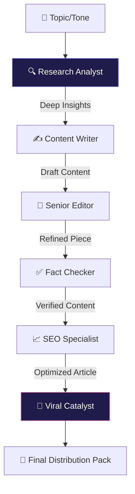

# 🔮 QuantumContent: The Autonomous Editorial Suite
### *Industrial-Grade Multi-Agent Content Orchestration Powered by CrewAI & DeepSeek-V3*

[](https://github.com/)
[](https://www.crewai.com/)
[](https://www.deepseek.com/)
[](LICENSE)

---

## 🚀 The Vision
**QuantumContent** is not a simple wrapper; it is a **Distributed Intelligence Engine** designed to replace traditional editorial departments. By leveraging a specialized crew of 6 AI Agents, it executes high-fidelity research, narrative construction, technical editing, and viral marketing distribution in a single unified pipeline.

---

## 🏗️ Neural Architecture (Sequential Intelligence)
The suite operates through a cascading reasoning loop where each agent builds upon the structural foundation of the predecessor:



---

## 💎 Premium Features
| Feature | Technical Implementation |
| :--- | :--- |
| **6-Agent Orchestration** | Advanced state management via CrewAI sequential processes. |
| **Multi-Tone Modulation** | Dynamic prompt engineering for professional, conversational, or academic voices. |
| **Viral Catalyst Pack** | Automatic generation of Twitter threads, LinkedIn posts, and DALL-E prompts. |
| **Glassmorphism UI** | Next-gen Streamlit dashboard with hardware-accelerated blurring and dark-mode gradients. |
| **Quality Audit System** | Integrated heuristic scoring for readability, structure, and engagement. |
| **Deep Research Tools** | Real-time web-scraping and duckduckgo search integration. |

---

## 🛠️ The Tech Stack
- **Engine:** CrewAI (Multi-Agent framework)
- **Model:** DeepSeek-V3 (via LangChain OpenAI integration)
- **Interface:** Streamlit (Custom Glassmorphism CSS)
- **Search:** DuckDuckGo API
- **Quality Analysis:** Custom NLP scoring logic

---

## 🏁 Installation & Deployment

### 1. Requirements
- Python 3.12+ 
- DeepSeek API Key

### 2. Setup
```bash
# Clone the repository
git clone https://github.com/your-username/QuantumContent.git
cd QuantumContent

# Initialize environment
python -m venv venv
source venv/bin/activate  # Windows: venv\Scripts\activate

# Install dependencies
pip install -r requirements.txt
```

### 3. Configuration
Create a `.env` file:
```env
DEEPSEEK_API_KEY=sk_...
```

### 4. Execution
```bash
streamlit run app.py
```

---

## 🗺️ Roadmap
- [ ] **Multi-Model Fusion**: A/B testing between GPT-4o and Claude 3.5.
- [ ] **Direct CMS Integration**: One-click publishing to WordPress & Ghost.
- [ ] **Autonomous Image Synthesis**: Native DALL-E 3 visual generation within the UI.
- [ ] **RAG Integration**: Power research using local PDF/Doc knowledge bases.

---

## 📄 License
This project is licensed under the MIT License - see the [LICENSE](LICENSE) file for details.

---

### 🔮 Powered by QuantumContent
*Forging the future of autonomous digital media.*
