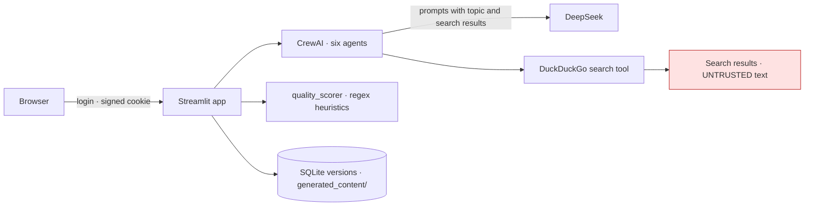

# Threat model

Scope: the Streamlit application (`app.py`), its login gate (`auth.py`), the
CrewAI pipeline it runs (`content_generation_crew.py`, `custom_tools.py`), the
quality scorer and version store, and the container. Out of scope: what
DeepSeek does with the prompts it receives, and the content of the web pages
the research tools read — both reach the pipeline by design.

What was open when the work started is stated per threat; "now" is the state
on the `production-readiness` branch after PR #1 and the follow-up commits.

## What it holds

| Asset | Where | Why it matters |
|---|---|---|
| `APP_SECRET_KEY` (cookie signing key) | environment | Whoever knows it can forge a logged-in session |
| `APP_PASSWORD` | environment, hashed in memory | The one credential for the one user |
| `DEEPSEEK_API_KEY` | environment | Billable; every generation is several model calls |
| Generated articles and their versions | `generated_content/`, the SQLite version table | The operator's work product |
| Topics entered by the user | prompts, logs | May reveal what is being written about before it is published |

## Trust boundaries

Two boundaries matter. The login gate is the only thing between the internet
and a button that spends model credit. And the researcher and fact-checker
agents read search results written by anyone, then hand them to a writer.

## Threats

| # | Threat | Was | Now | Remaining |
|--:|---|---|---|---|
| T1 | A forged session skips the login form | The cookie was signed with `"some_random_secret_key"`, committed to the repository | Production refuses a missing or placeholder key before Streamlit starts; development uses a random per-process key ([ADR 0001](adr/0001-the-login-gate-fails-closed.md)) | Key rotation is manual and logs everyone out |
| T2 | Default credentials | `admin` / `admin` accepted when `APP_PASSWORD` was unset | Production refuses an unset or well-known password at preflight | One user; no lockout or rate limit on the login form beyond what streamlit-authenticator provides |
| T3 | The gate switched off in production | `ENABLE_AUTH=false` disabled authentication with no guard | Refused when `ENVIRONMENT=production` | Depends on `ENVIRONMENT` being set; the image sets it |
| T4 | Cost amplification | Any logged-in user could start unlimited generations | Unchanged in kind: one operator, one password. The pipeline is synchronous and one generation blocks the Streamlit session, which bounds concurrency by accident rather than design | No quota, no per-run budget, no rate limit |
| T5 | Prompt injection from search results into the article | Search results went to the writer with no control | Unchanged in kind; the article is shown to the operator, scored, and saved — nothing publishes it | No injection filter; the fact-checker is a model prompt, not a control; the operator reads before publishing |
| T6 | A deployment that is up but broken | Without `DEEPSEEK_API_KEY` the app died importing the crew; with a misconfigured gate the health check said "ok" while every page showed an error | The client is built on first use and a missing key is reported in the page; the preflight refuses an unsafe gate before the port binds; CI boots the image ([ADR 0003](adr/0003-the-model-client-is-built-on-first-use.md)) | — |
| T7 | Secrets in the image or repository | No `.dockerignore`; `.env` would have been copied by `COPY . .`; the signing key was in the source | `.dockerignore`; `.env` gitignored; CI greps for a hardcoded signing key used as a default | Secret scanning covers the tree, not history; the placeholder key is in history as the value that was rejected |
| T8 | Root container | The image ran as root with `build-essential` in the runtime layer | Two stages, uid 10001, Python health probe | — |
| T9 | Vulnerable dependencies | Thirteen bare package names with no constraints | Ranges pinned; `pip-audit` and `bandit` run in CI (the audit result at the time of writing is in the README) | Ranges, not exact pins: an audit failure is the signal to pin |
| T10 | The system is mistaken for what its README said it was | "Industrial-grade", "publication-ready assets, SEO dominance and viral distribution packs in seconds", "Post-GPT reasoning", "CSS3 hardware acceleration"; a UI metric reading "Complexity Index: High" as a constant | The README describes six prompts over one model with a search tool, a regex scorer and a SQLite version table, and states the repository's origin | — |

## Failure modes that fail closed

- Production start with a missing or placeholder `APP_SECRET_KEY`, a
  well-known `APP_PASSWORD`, or `ENABLE_AUTH=false`: the preflight exits 1 and
  Streamlit never starts.
- No model key: the login page is served; generation is refused with a sentence
  naming the variable.
- A misconfigured gate when the app is run directly rather than through the
  entrypoint: `check_authentication()` shows the error and stops the script.
- Removing the signing-key guard: a CI grep and the auth tests fail.
